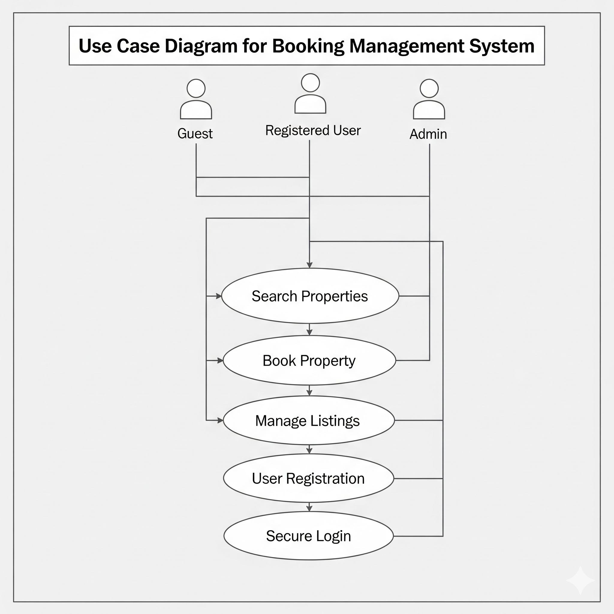

# Requirement Analysis in Software Development

This repository is dedicated to the study and application of requirement analysis in software development. It aims to provide a comprehensive understanding of how to gather, document, and validate requirements to ensure successful project outcomes. Through this repository, learners will explore key concepts, methodologies, and tools essential for effective requirement analysis.

## What is Requirement Analysis?

Requirement Analysis is a critical phase in the software development lifecycle (SDLC) where the project team gathers, analyzes, and defines the requirements of the software product to be developed. This process involves several activities aimed at ensuring that all stakeholders have a clear and mutual understanding of what the system should do and how it should perform.

### Importance of Requirement Analysis in the SDLC:

1. **Clarity and Understanding:**  
   Requirement Analysis helps in clarifying the objectives and expectations of the stakeholders. It ensures that everyone involved has a shared understanding of the project's goals.

2. **Foundation for Development:**  
   Well-defined requirements serve as a foundation for the subsequent phases of the SDLC, including design, development, testing, and deployment. They guide developers in creating a product that meets user needs.

3. **Risk Management:**  
   By identifying and addressing potential issues early in the process, Requirement Analysis helps in mitigating risks associated with project scope, timelines, and costs.

4. **Quality Assurance:**  
   It ensures that the final product aligns with user expectations and requirements, thus enhancing quality and user satisfaction.

5. **Efficient Resource Allocation:**  
   Understanding requirements allows for better planning and allocation of resources, leading to more efficient project execution.

In summary, Requirement Analysis is an essential process that sets the stage for successful software development by ensuring that all requirements are accurately captured and understood before moving forward.

## Why is Requirement Analysis Important?

Requirement Analysis is a crucial component of the software development lifecycle (SDLC) for several reasons:

1. **Ensures Stakeholder Alignment:**  
   Requirement Analysis involves gathering input from all stakeholders, ensuring that their needs and expectations are understood and documented. This alignment minimizes misunderstandings and helps avoid scope creep later in the project.

2. **Facilitates Effective Planning:**  
   By clearly defining requirements, teams can better estimate project timelines, budgets, and resources. This allows for more accurate project planning and helps in organizing tasks efficiently, leading to smoother project execution.

3. **Enhances Quality Assurance:**  
   Detailed requirement specifications serve as a foundation for testing and validation processes. With well-defined requirements, teams can develop robust test cases that ensure the final product meets user needs and quality standards.

In summary, Requirement Analysis is vital for aligning stakeholder expectations, facilitating effective planning, and enhancing the overall quality of the software product.

## Key Activities in Requirement Analysis

Requirement Analysis involves several key activities that ensure a thorough understanding of the project's requirements. Here are the five primary activities:
    - **Requirement Gathering:**  
  This activity involves collecting information from stakeholders through various methods such as interviews, surveys, and workshops. The goal is to understand the needs and expectations of users and other stakeholders.
    - **Requirement Elicitation:**  
  In this phase, the gathered requirements are refined and elaborated upon. Techniques like brainstorming, prototyping, and use cases are employed to clarify and expand on the initial requirements.
    - **Requirement Documentation:**  
  This activity focuses on creating detailed documents that outline the requirements. This includes requirement specifications, use case diagrams, and other relevant artifacts that serve as a reference throughout the development process.
    - **Requirement Analysis and Modeling:**  
  During this phase, the documented requirements are analyzed for feasibility and consistency. Modeling techniques, such as data flow diagrams or UML diagrams, may be used to visualize the requirements and their interactions.
    - **Requirement Validation:**  
  The final activity involves reviewing the documented requirements with stakeholders to ensure accuracy and completeness. This step confirms that the requirements align with stakeholder expectations and are ready for implementation.

## Types of Requirements

### Functional Requirements

Functional requirements describe what the system should do. They define specific behaviors or functions of the system, detailing how users will interact with it. For the booking management project, examples include:
    - **User Registration:**  
  The system shall allow new users to create an account by providing personal details such as name, email, and password.
    - **Secure Login:**  
  Users shall be able to log in securely using their registered email and password, with password recovery options provided.
    - **Property Search:**  
  The system shall enable users to search for available properties based on various criteria such as location, price range, and property type.

### Non-functional Requirements

Non-functional requirements describe how the system performs its functions. They focus on quality attributes such as performance, security, and usability. For the booking management project, examples include:
    - **Performance:**  
  The system shall load property search results within 2 seconds to ensure a smooth user experience.
    - **Security:**  
  The system shall implement encryption for user passwords and sensitive data to protect user information from unauthorized access.
    - **Scalability:**  
  The system shall support at least 1000 concurrent users without performance degradation, ensuring reliability during peak usage times.

## Use Case Diagrams

Use Case Diagrams are visual representations that illustrate how different users (actors) interact with a system to achieve specific goals (use cases). They are a crucial part of Requirement Analysis as they provide a clear and concise way to visualize system functionalities and user interactions.

### Benefits of Use Case Diagrams:
    - **Clarity:**  
  They help clarify system requirements by visually representing user interactions, making it easier to understand what the system will do.
    - **Communication:**  
  Use Case Diagrams facilitate communication among stakeholders, developers, and project managers by providing a common visual language.
    - **Identification of Requirements:**  
  They assist in identifying and organizing system requirements by showcasing the relationship between actors and use cases.

### Use Case Diagram for Booking Management System

Below is the use case diagram for the booking management system, illustrating the interactions between users and the system:

## Acceptance Criteria

Acceptance Criteria are conditions that a feature must meet to be accepted by stakeholders. They play a vital role in Requirement Analysis and help ensure that the developed product aligns with user expectations and requirements.

### Importance of Acceptance Criteria in Requirement Analysis:
    - **Clarity:**  
  Acceptance Criteria provide clear and measurable conditions that define the expected outcome of a feature, ensuring that all stakeholders have a shared understanding of what is required.
    - **Basis for Testing:**  
  They serve as a foundation for testing and validation, allowing the development team to create test cases that verify if the feature meets the specified criteria.
    - **Quality Assurance:**  
  By establishing clear acceptance criteria, teams can maintain quality and ensure that user expectations are met before the feature is considered complete.

### Example of Acceptance Criteria for the Checkout Feature:

For the Checkout feature of the booking management system, the acceptance criteria could be defined as follows:
    - **Users should be able to add selected properties to their cart.**
    - **The system shall calculate the total cost accurately, including taxes and fees, and display it before confirmation.**
    - **Users must receive a confirmation email within 5 minutes of completing their booking.**
    - **Users should be able to view and download their booking receipt from their account page.**

  
